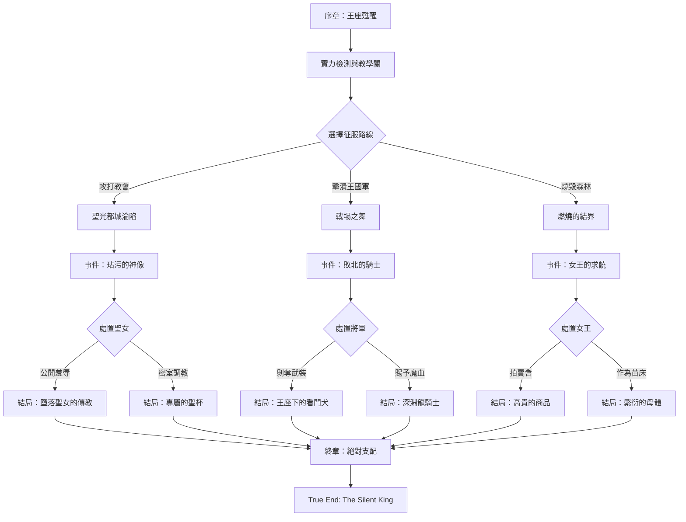

# 故事流程圖

```mermaid
graph TD
    Start[序章：王座甦醒] --> Check[實力檢測與教學關]
    Check --> RouteSelection{選擇征服路線}
    
    %% 聖女路線
    RouteSelection -->|攻打教會| StLumina[聖光都城淪陷]
    StLumina --> EventCelestia1[事件：玷污的神像]
    EventCelestia1 --> ChoiceCelestia{處置聖女}
    ChoiceCelestia -->|公開羞辱| PathA1[結局：墮落聖女的傳教]
    ChoiceCelestia -->|密室調教| PathA2[結局：專屬的聖杯]

    %% 將軍路線
    RouteSelection -->|擊潰王國軍| BattleField[戰場之舞]
    BattleField --> EventValkyrie1[事件：敗北的騎士]
    EventValkyrie1 --> ChoiceValkyrie{處置將軍}
    ChoiceValkyrie -->|剝奪武裝| PathB1[結局：王座下的看門犬]
    ChoiceValkyrie -->|賜予魔血| PathB2[結局：深淵龍騎士]

    %% 精靈路線
    RouteSelection -->|燒毀森林| ForestFire[燃燒的結界]
    ForestFire --> EventElysia1[事件：女王的求饒]
    EventElysia1 --> ChoiceElysia{處置女王}
    ChoiceElysia -->|拍賣會| PathC1[結局：高貴的商品]
    ChoiceElysia -->|作為苗床| PathC2[結局：繁衍的母體]

    %% 共通線收束
    PathA1 & PathA2 & PathB1 & PathB2 & PathC1 & PathC2 --> GrandFinale[終章：絕對支配]
    GrandFinale --> TrueEnd[True End: The Silent King]
```