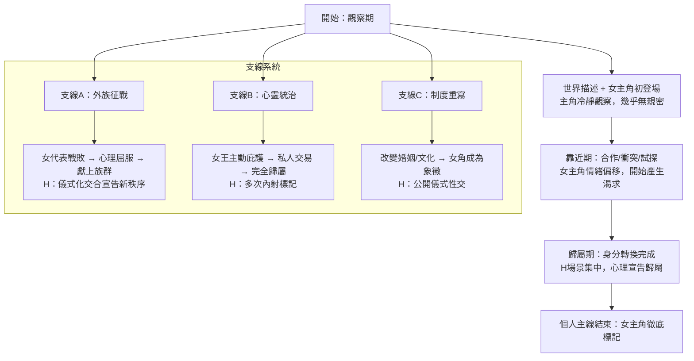

# 故事流程圖（Mermaid 語法）

```mermaid
graph TD
    A[開始：觀察期] --> B[世界描述 + 女主角初登場<br>主角冷靜觀察，幾乎無親密]
    B --> C[靠近期：合作/衝突/試探<br>女主角情緒偏移，開始產生渴求]
    C --> D[歸屬期：身分轉換完成<br>H場景集中，心理宣告歸屬]
    D --> E[個人主線結束：女主角徹底標記]

    subgraph 支線系統
        F[支線A：外族征戰] --> G[女代表戰敗 → 心理屈服 → 獻上族群<br>H：儀式化交合宣告新秩序]
        H[支線B：心靈統治] --> I[女王主動庇護 → 私人交易 → 完全歸屬<br>H：多次內射標記]
        J[支線C：制度重寫] --> K[改變婚姻/文化 → 女角成為象徵<br>H：公開儀式性交]
    end

    A --> F
    A --> H
    A --> J
```